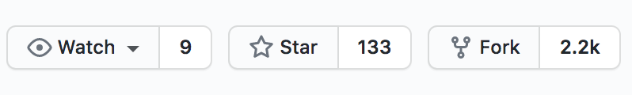

# Setup

In this lab, you will use the Katacoda minikube cluster. Within it, you will install the Flux GitOps operators and setup a GitHub account to be integrated with the GitOps deployment.

## GitHub Account

You'll want to create a new repository for this tutorial and make it available from your cluster through a git URL.

Of course, you can also configure the Flux operator to use a private git host, but configuring this is outside the scope of this introductory tutorial.

### 1. Setup GitHub Account

If you do not already have a GitHub account, create one by visiting https://github.com/

Sign up for an account with
```
username: first-last-slalom
email: Slalom email
password: something secure that you will remember
```

### 2. Fork the Flux Get Started repository

In order to control the operation of your cluster using GitOps, you'll need to have a control repository in which the state of your cluster can be defined. For this tutorial, we will use the code in the Flux Get Started repository. `https://github.com/fluxcd/flux-get-started` is already set up with all the files you'll need to follow along. Fork it to your GitHub account.

To Fork the repository:

1. Make sure you are logged into your Github Account at `https://github.com/firstname-lastname-slalom`
1. Open `https://github.com/fluxcd/flux-get-started` in your browser
1. Click the  icon

### 3. Start the minikube cluster

Check the status of your cluster

`minikube status`{{execute}}

You should see
```shell
host: Starting
kubelet: Starting
apiserver: Starting
kubeconfig: Starting
```

Give it a minute to start and check the status again

Once it is running, you should see
```shell
host: Running
kubelet: Running
apiserver: Running
kubeconfig: Configured
```

If you see any errors, run

`minikube start`{{execute}}
